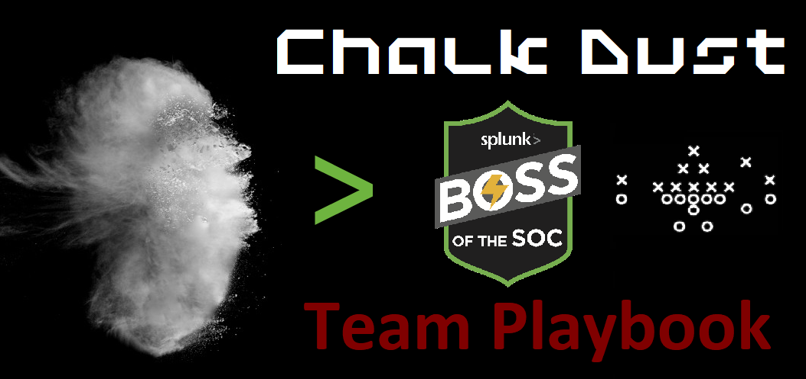

___
Greetings! This playbook contains a synopsis of the scenarious and functionality from the Hunting with Splunk blog post series, as well as the Security Investigation Online Experience labs. Resources in this playbook can potentially be matched with challenges presented during the event, helping to expedite solutions and propel our team towards victory! :rocket: 
___

## Contents

- [Hunting with Splunk Blog Posts](#Hunting-with-splunk)
- [Security Investigation Online Experience Labs](#Security-Investigation-Online-Experience)

# Hunting with Splunk

## Lookup Before You Go-Go...Hunting
[link to blog post](https://www.splunk.com/en_us/blog/security/lookup-before-you-go-go-hunting.html/)

* Find hosts on your network connecting to public DNS servers using a lookup file.
* Leverage a lookup file to provide descriptions of windows event logs. 

## Finding Islands in the Stream (of Data)...
[link to blog post](https://www.splunk.com/en_us/blog/security/finding-islands-in-the-stream-of-data.html/)

Splunk Stream is a free application that is an extension of Splunk Enterprise.
Advantages of Splunk Stream:
1. Can see traffic over the wire from over 28 different protocols some of which include TCP, UDP, DNS, HTTP, and FTP.
2. Let's say you just want to see FTP but not HTTP traffic; you can do that.
3. Stream can parse PCAP files.

* Inspect suspicious domains in DNS to find high levels of Shannon entropy or potentially dissect the various aspects of the FQDN.
* Monitor internal HTTP traffic. Rather than just your typical egress points of traffic coming from edge devices. 

## Work(flow)ing Your OSINT
[link to blog post](https://www.splunk.com/en_us/blog/security/work-flow-ing-your-osint.html/)

* Use Splunk workflow to analyze a field.
* Create a workflow that performs an open source intelligence search against destination IP addresses. 

## MetaData > MetaLore
[link to blog post](https://www.splunk.com/en_us/blog/security/metadata-metalore.html/)

* Use the metadata command to see hosts that have not sent data to Splunk in the last 24 hours.
* Use the tstats command to quickly see event counts in a visual timeline
* Build a search to identify hosts that are logging more or less data than what is expected. 

## Peeping Through Windows (Logs)
[link to blog post](https://www.splunk.com/en_us/blog/security/peeping-through-windows-logs.html/)

Windows event logs to focus in on:
* 4688 - A new process has been created. If a Windows computer had a virus, events with this code would show processes created by the virus. 
* 4738 - A user account was changed. This is logged whenever a user account is changed. This can be useful to see when an account was granted administrator privileges.
* 4624 - Created when account successfully logs into Windows environment. Can be useful to find outliers in login activity. 
* 1102 - Occurs when an administrator account clears the audit logs on Windows. 

## I Need To Do Some Hunting. Stat!
[link to blog post](https://www.splunk.com/en_us/blog/security/i-need-to-do-some-hunting-stat.html/)

* Using stats command to find multiple hosts on the network sending and receiving large amounts of bytes from the same destination IP address.
* Use the event stats command to see hosts that have 60 percent of their traffic going to a single destination. 
* Use the streamstats command to create a visualization that shows for statistics to be generated as each event is seen. 

> The article concludes showing a source IP address that was a chart topper for byes sent and received sending 77% of its traffic to a specific destination. 

## This is NOT the Data You Are Looking For (OR is it)
[link to blog post](https://www.splunk.com/en_us/blog/security/this-is-not-the-data-you-are-looking-for-or-is-it.html/)

1. Use time ranges to narrow your results.
2. Searching Splunk by using simple phrases and hitting enter is called super-grepping.
3. Use field-value expressions to narrow searches.
4. Things to consider leveraging when creating your SPL search are:
    * Field names - case sensitive 
    * Field values - case insensitive 
    * Wildcards - in field-value pairs
    * Boolean operators - AND, OR, and NOT
    * Comparison operators - <, >, <=, >=, and !=

__"NOT" and "!=" Example:__  
`(index=web OR index=security) status!=200` Returns all events containing status where it is not equal to 200
`(index=web OR index=security) NOT status=200` Returns all events that do not contain status=200
 
## Rex Groks Gibberish
[link to blog post](https://www.splunk.com/blog/2017/08/30/rex-groks-gibberish.html/)

* Splunk provides rex and regex in SPL.
* Use regex to create fields on event. 
* Find passwords being sent in plain text over the network. 
* Use regex to search for only specific cidr blocks.

## UT_parsing Domains Like House Slytherin
[link to blog post](https://www.splunk.com/en_us/blog/security/ut-parsing-domains-like-house-slytherin.html/)

According to this article URL Toolbox is one of three essential security Splunk apps.
* URL Toolbox is not a command. 
* You use is via macros. 
* Don't forget to use `ticks` to specify macros. 

The most popular macro in the URL toolbox is `ut_parse_extended(2)` which pasrses URL and passes the data to multiple fields. 

URL Toolkit can be used to slice and dice URLs in events as many different ways as you want. It's said to be easier to use and powerful than regex when working with domains. 

__Example:__   
this URL `http://davidveuve.com/tech/how-i-do-summary-indexing-in-splunk/`  
can turn into `field - value`  
ut_domain - davidveuve.com  
ut_domain_without_id - davidveuve  
AND MORE

## You Can’t 'Hyde' from Dr. Levenshtein When You Use URL Toolbox
[link to blog post](https://www.splunk.com/en_us/blog/tips-and-tricks/you-can-t-hyde-from-dr-levenshtein-when-you-use-url-toolbox.html/)

Use URL Toolbox to calculate the Levenshetein difference of emails being received by your organization, hypothosizing that attackers are using domains that are very similar to your actual domain. 

The Levenshetein distance is the number of changes made to turn one string into another. If one string is Panda and the other is Pando, the distance would be 1 to change the a to an o. Using this we can discover fraudulent emails where attackers make the email similar to the actual one.

Shannon Entropy allows us to calculate the amount of randomness that is present in a string. Leveraging this can allow you to search for algorithmically generated domain names, which are often used in malware. The example given hypothesizes that malware on the network is using randomized domain names to communication with other malicious infrastructure. 

Looking for domains with entropy of greater than 3 can be a starting point, but you will need to adjust as needed to have low false positives.

## Do We Calculate, Appraise, Classify, Estimate? Yes, But We Do It All with...
[link to blog post](https://www.splunk.com/en_us/blog/tips-and-tricks/do-we-calculate-appraise-classify-estimate-yes-but-we-do-it-all-with-evaluate-eval.html/)

Use the eval command to identify abnormally long process strings such as ones in Microsoft Sysmon processes. Process strings that are several degrees of magnitude larger than the standard deviation of process strings on a system should be inspected as they could be running malware. 

Use eval to calculate how many days have passed since a command line string was executed on the system that created the process. If a process string is abnormally long in comparison to what is typical on a machine AND it is long running, that can be signs of malware. 

## Tall Tales of Hunting with TLS/SSL Certificates
[link to blog post](https://www.splunk.com/en_us/blog/security/tall-tales-of-hunting-with-tls-ssl-certificates.html/)

Leverage SSL certification information to find intrusion on your network. What is discussed in those post only works if you have captured SSL metadata in Splunk.

## Finding NEW Evil: Detecting New Domains with Splunk
[link to blog post](https://www.splunk.com/en_us/blog/security/finding-new-evil-detecting-new-domains-with-splunk.html/)

Users are creatures of habit and will typically visit the same roughly 20 sites per day and that visits to entirely new sites could be suspicious or potentially malicious. Malicious domains can leverage dynamic domains, which are subdomains created to be more legitimate-looking and human readable. 

Sources of network traffic mentioned in this article are web proxy logs and DNS data. 

The methods in this article continue to leverage URL Toolbox. 

## Being Your Own Detective with SA-Investigator
[link to blog post](https://www.splunk.com/en_us/blog/security/being-your-own-detective-with-sa-investigator.html/)

# Security Investigation Online Experience

## Splunk for Security Investigate: Threat Validation  
Exercise 1 - Detection  
* Identify patterns of login failures across all systems.

Exercise 2 - Validation    
* Brute force activity to random web hosts from internal host that has been infected by malware. 
* Isolate password failures to a single host and examine all activity from workstation. Then visualize attempts of failed login attempts to better get an idea as to what the bad actor was doing. 

Exercise 3 - Scoping  
* After identifying the internal workstation responsible for the attempted login activity, you must identity the scope and effect of the activities taken by the compromised workstation. 
* Identify the following:  
    * Were any of the access attempts successful  
    * What user account and privileges were used  
    * What actions were performed on the target system?  

## Security Endpoint Analysis with Splunk  

* Detecting process anomalies from MS Sysmon Events.
* Searching for windows Office execution of unusual process.
* Detecting encryption activities by ransomware binaries.
* Prevention via action between infection and encryption.
* By analyzing average process command line length by looking at sysmon events that contain endpoint activities.
* Malware tends to use long commands or wscript. By looking at the standard deviation of command lengths on a workstation then looking for command lengths that are 4 times that. You can identify uncharacteristly long commands that could be malicious. 

## Security Web Proxy Analysis with Splunk

* Web Proxy Command Control Activity Analysis
* Looking at data on a firewall, web proxy, or NetFlow contains records between all users and hosts. One example is leveraging web proxy traffic can help identify malicious activities on the network in addition to identifying Command and Control activities. 

